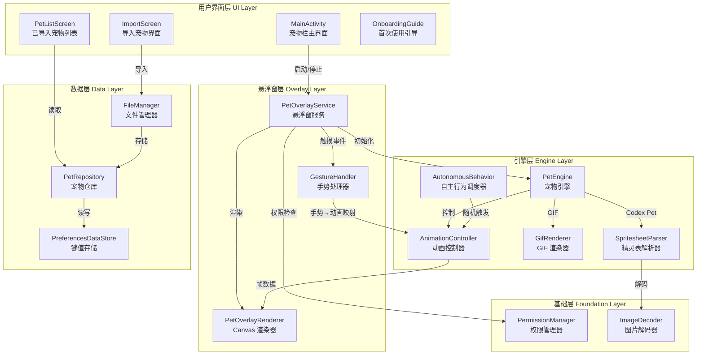
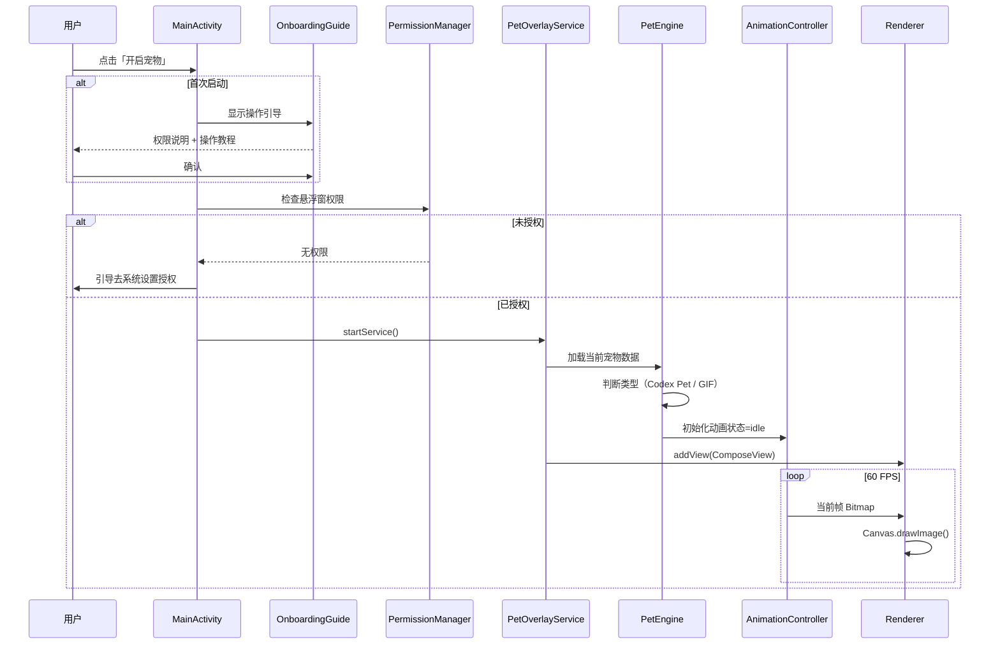
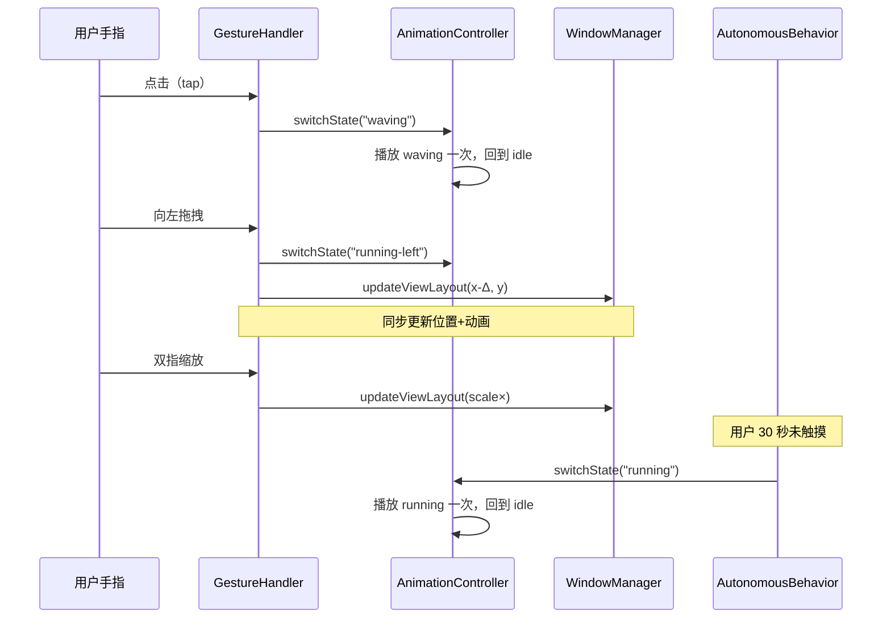
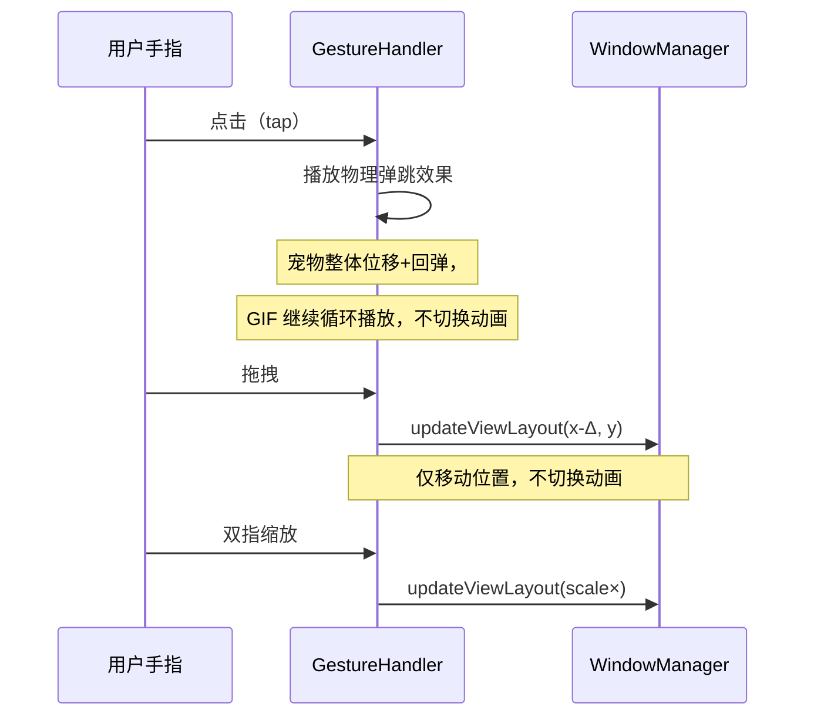
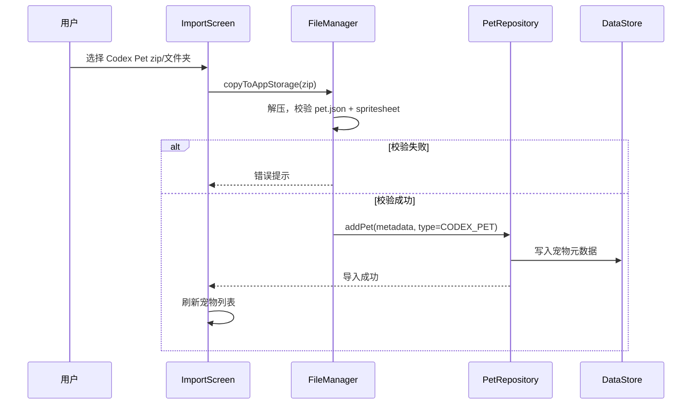
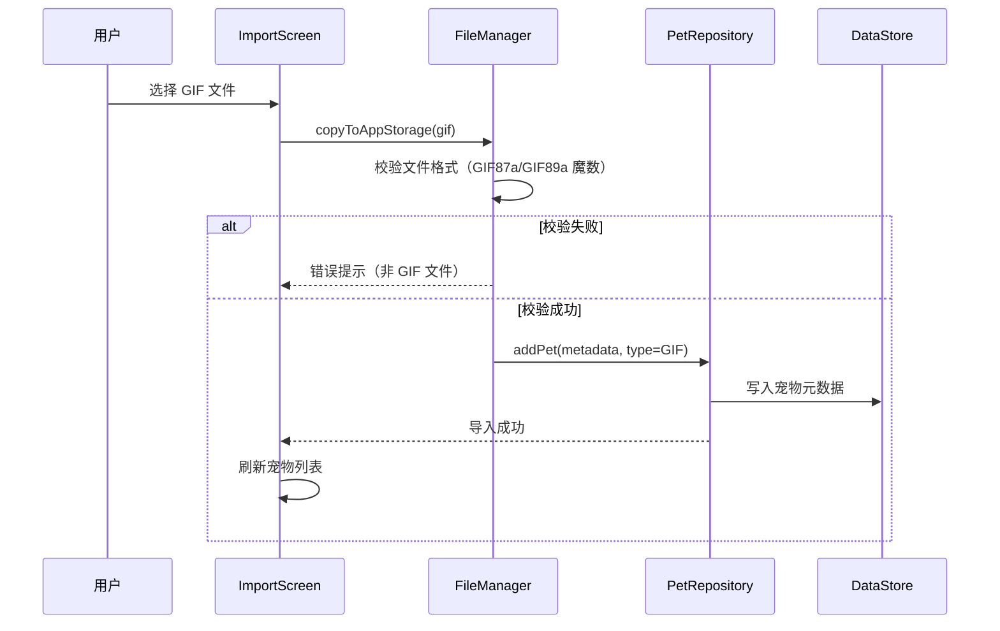
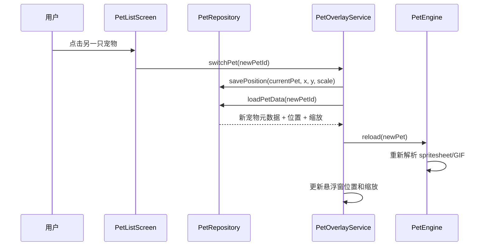

# 桌面宠物 App — 概要设计文档

> 版本：v1.0  
> 日期：2026-05-25  
> 依赖：`doc/proposal.md`

---

## 1. 系统总体架构

### 1.1 架构图



### 1.2 架构说明

采用**分层架构**，自上而下 5 层：

| 层 | 职责 | 依赖方向 |
|----|------|----------|
| **UI 层** | Jetpack Compose 界面，用户交互入口 | → 数据层 / 悬浮窗层 |
| **悬浮窗层** | WindowManager 管理、Canvas 渲染、手势处理 | → 引擎层 / 基础层 |
| **引擎层** | 宠物格式解析、动画控制、自主行为 | → 基础层 |
| **数据层** | 宠物元数据持久化、文件管理 | → 基础层 |
| **基础层** | 权限、图片解码等通用能力 | 无依赖 |

---

## 2. 模块划分与职责说明

### 2.1 UI 层

| 模块 | 核心职责 | 技术 |
|------|----------|------|
| **MainActivity** | 单一 Activity，承载所有 Compose 界面；管理悬浮窗的启动/停止；首次启动显示操作引导 | Jetpack Compose |
| **OnboardingGuide** | 首次使用时展示悬浮窗权限说明和基本操作教程（点击/拖拽/缩放） | Compose Dialog |
| **PetListScreen** | 展示已导入宠物列表（缩略图+名称），点击切换当前宠物 | Compose LazyColumn |
| **ImportScreen** | 文件选择器入口，区分 Codex Pet 包和 GIF 文件导入 | SAF / ActivityResultContracts |
### 2.2 悬浮窗层

| 模块 | 核心职责 | 技术 |
|------|----------|------|
| **PetOverlayService** | 管理和控制悬浮窗生命周期（启动→addView / 停止→removeView） | `Service` + `WindowManager` |
| **PetOverlayRenderer** | 在 Compose Canvas 上绘制宠物帧（精灵表切帧或 GIF 解码帧） | `ComposeView` + `Canvas` |
| **GestureHandler** | 处理 tap/drag/pinch-zoom：Codex Pet 宠物→手势映射为动画状态切换+位置更新；GIF 宠物→tap 触发物理弹跳效果，drag 仅移动位置，不切换动画 | `pointerInput` × 3 |

### 2.3 引擎层

| 模块 | 核心职责 | 技术 |
|------|----------|------|
| **PetEngine** | 引擎入口，根据宠物类型（Codex Pet / GIF）分发到对应渲染器 | 策略模式 |
| **SpritesheetParser** | 解析 pet.json + spritesheet.webp，提取 9 行动画帧 | BitmapRegionDecoder |
| **GifRenderer** | 解码 GIF 帧序列，按帧间隔循环输出 | Coil coil-gif |
| **AnimationController** | 管理当前动画状态、帧索引、帧率（60FPS tick），输出当前应绘制的帧 | `withFrameMillis` |
| **AutonomousBehavior** | 随机间隔触发自主行为（running/jumping/waiting/review），将状态切换指令发给 AnimationController（**仅 Codex Pet 宠物**，GIF 宠物无此模块） | 协程 `delay(random)` |

### 2.4 数据层

| 模块 | 核心职责 | 技术 |
|------|----------|------|
| **PetRepository** | 提供宠物 CRUD 接口，屏蔽底层存储细节 | Repository 模式 |
| **PreferencesDataStore** | 持久化：宠物列表元数据 + 每只宠物的位置(x,y) + 缩放(scale)。键名格式：`pet_{id}_x`、`pet_{id}_y`、`pet_{id}_scale`、`active_pet_id` | Jetpack DataStore |
| **FileManager** | 处理文件导入：复制 spritesheet/GIF 到 App 内部存储，解压 zip | `Context.filesDir` |

### 2.5 基础层

| 模块 | 核心职责 | 技术 |
|------|----------|------|
| **PermissionManager** | 检查和请求 `SYSTEM_ALERT_WINDOW` 权限 | `Settings.canDrawOverlays()` |
| **ImageDecoder** | 统一图片解码：WebP、PNG、GIF（GIF 帧由 Coil 处理） | BitmapFactory / Coil |

---

## 3. 模块间交互流程

### 3.1 启动宠物 → 悬浮窗显示



### 3.2 触摸交互流程

**Codex Pet 宠物：**



**GIF 宠物：**



### 3.3 导入宠物流程

**Codex Pet 素材包导入：**



**GIF 动图导入：**



### 3.4 切换宠物流程



---

## 4. 关键技术选型说明

### 4.1 选型总览

| 技术领域 | 选型 | 备选 | 选型理由 |
|----------|------|------|----------|
| **开发语言** | Kotlin | Java | 现代化、协程原生、Google 主推 |
| **UI 框架** | Jetpack Compose | XML View | 声明式、与悬浮窗 ComposeView 统一、手势 API 完善 |
| **悬浮窗方案** | `Service` + `WindowManager` | Foreground Service | 跟随 App 生命周期（需求 3.7），Android 14+ 无需声明 `specialUse` |
| **动画渲染** | Compose `Canvas` | SurfaceView | 60FPS 已验证可行（参考 Akimeji 项目），与 Compose 手势体系无缝集成 |
| **GIF 解码** | Coil + `coil-gif` | Glide | API26+ 自动回退 GifDecoder，Kotlin 原生，Compose 集成（`AsyncImage`） |
| **本地存储** | Preferences DataStore | Room | 宠物元数据是简单键值对，DataStore 异步、类型安全，Room 过重 |
| **图片解码** | `BitmapRegionDecoder` | 手动切图 | Android 原生，按区域解码 spritesheet cell，内存友好 |
| **协程** | Kotlin Coroutines + Flow | RxJava | 官方推荐，Compose 原生集成 |
| **构建系统** | Gradle (Kotlin DSL) | Groovy | 类型安全、IDE 支持好 |

### 4.2 Android 14+ 兼容说明

- **不使用 Foreground Service**，因此无需处理 Android 14 的 `foregroundServiceType` 要求
- `TYPE_APPLICATION_OVERLAY` 在 API 26+ 可用，无需 `TYPE_PHONE`（已废弃）
- `SYSTEM_ALERT_WINDOW` 权限：Android 8.0+ 自动授予（从 Play Store 安装）或需手动开启

### 4.3 关键依赖库

```kotlin
// build.gradle.kts (app)
dependencies {
    // Compose
    implementation("androidx.compose.ui:ui")
    implementation("androidx.compose.material3:material3")
    implementation("androidx.activity:activity-compose")
    
    // DataStore
    implementation("androidx.datastore:datastore-preferences")
    
    // Coil (GIF)
    implementation("io.coil-kt.coil3:coil-compose:3.4.0")  // 以实际最新稳定版为准
    implementation("io.coil-kt.coil3:coil-gif:3.4.0")  // 以实际最新稳定版为准
    
    // Coroutines
    implementation("org.jetbrains.kotlinx:kotlinx-coroutines-android")
    
    // JSON parsing (pet.json)
    implementation("org.jetbrains.kotlinx:kotlinx-serialization-json")
}
```

---

## 5. 数据模型设计

### 5.1 宠物元数据

```kotlin
@Serializable
data class PetInfo(
    val id: String,              // UUID
    val type: PetType,           // CODEX_PET / GIF
    val displayName: String,     // 显示名称
    val petJsonPath: String?,    // pet.json 路径（仅 Codex Pet）
    val spritesheetPath: String, // spritesheet 或 GIF 文件路径
    val positionX: Float = 0f,   // 悬浮窗 X 坐标
    val positionY: Float = 200f, // 悬浮窗 Y 坐标
    val scale: Float = 1.0f,     // 缩放比例
    val isActive: Boolean = false // 是否当前显示
)

enum class PetType { CODEX_PET, GIF }
```

### 5.2 Codex Pet 配置（pet.json 解析结果）

```kotlin
@Serializable
data class CodexPetConfig(
    val id: String,
    val displayName: String,
    val description: String,
    val spritesheetPath: String,
    val schema_version: String? = null,  // "codexpet.v1"
    val states: List<AnimationState>? = null
)

@Serializable
data class AnimationState(
    val name: String,   // "idle", "running-right", etc.
    val row: Int,       // 0-8
    val frames: Int     // 该行动画帧数
)
```

### 5.3 动画状态枚举

```kotlin
enum class PetAnimationState(val row: Int, val specName: String) {
    IDLE(0, "idle"),
    RUNNING_RIGHT(1, "running-right"),
    RUNNING_LEFT(2, "running-left"),
    WAVING(3, "waving"),
    JUMPING(4, "jumping"),
    FAILED(5, "failed"),        // 保留
    WAITING(6, "waiting"),
    RUNNING(7, "running"),
    REVIEW(8, "review");
    
    companion object {
        fun fromSpecName(name: String): PetAnimationState? =
            entries.find { it.specName.equals(name, ignoreCase = true) }
    }
}
```

---

## 6. 风险评估与应对方案

| 风险 | 概率 | 影响 | 应对方案 |
|------|------|------|----------|
| **悬浮窗权限被系统自动回收**（MIUI/ColorOS 等国产 ROM 杀后台） | 高 | 宠物消失，体验差 | ① 引导用户添加白名单 ② 提供一键重新开启入口 ③ Service `onTaskRemoved` 优雅清理 |
| **60FPS 渲染掉帧**（低端机 Canvas 性能不足） | 中 | 动画卡顿 | ① 动态降帧到 30FPS ② 缓存预解码的 Bitmap ③ 使用 `remember` 避免重组 |
| **GIF 解码内存溢出**（大尺寸 GIF） | 中 | App 崩溃 | ① 导入时限制 GIF 最大尺寸（如 ≤ 10MB）② Coil 内置内存缓存 ③ 采样解码 |
| **pet.json 格式不兼容**（社区宠物格式差异） | 中 | 导入失败 | ① 宽松解析，缺省字段用默认值 ② 无 `states` 数组时按标准 9 行硬编码映射 ③ 错误提示明确 |
| **Android 版本碎片化**（API 26-34 行为差异） | 低 | 部分设备异常 | ① 最低 API 26 覆盖 90%+ 设备 ② 条件分支处理 API 差异 ③ 模拟器多版本测试 |
| **GIF 宠物无法响应拖拽方向动画**（用户预期 VS 实际） | 低 | 体验降级 | ① 导入时明确标注 GIF 限制 ② 拖拽时至少移动位置 ③ 未来版本考虑 GIF 帧映射 |
| **DataStore 数据损坏** | 低 | 宠物列表丢失 | ① 提供「重置」功能 ② 关键数据多副本 ③ 异常捕获降级为空列表 |

---

## 7. 目录结构

```
app/src/main/java/com/deskpet/
├── MainActivity.kt              # 唯一 Activity，Compose 入口
├── ui/
│   ├── PetListScreen.kt         # 宠物栏列表
│   ├── ImportScreen.kt          # 导入界面
│   ├── OnboardingGuide.kt       # 首次使用引导
│   └── theme/                   # Compose 主题
├── overlay/
│   ├── PetOverlayService.kt     # 悬浮窗 Service
│   ├── PetOverlayRenderer.kt    # Canvas 渲染器
│   └── GestureHandler.kt        # 手势处理
├── engine/
│   ├── PetEngine.kt             # 引擎入口（策略分发）
│   ├── SpritesheetParser.kt     # Codex Pet 精灵表解析
│   ├── GifRenderer.kt           # GIF 帧渲染
│   ├── AnimationController.kt   # 动画状态机 + 帧率控制
│   └── AutonomousBehavior.kt    # 自主行为调度
├── data/
│   ├── PetRepository.kt         # 宠物仓库
│   ├── PetStore.kt              # DataStore 封装
│   ├── FileManager.kt           # 文件管理
│   └── model/
│       ├── PetInfo.kt           # 宠物元数据
│       ├── CodexPetConfig.kt    # pet.json 解析模型
│       └── PetAnimationState.kt # 动画状态枚举
└── foundation/
    ├── PermissionManager.kt     # 权限管理
    └── ImageDecoder.kt          # 图片解码工具

app/src/main/
├── AndroidManifest.xml          # 声明 Service、权限
└── res/                         # 资源文件（图标、字符串等）

build.gradle.kts                # 项目构建配置（依赖、SDK 版本）
settings.gradle.kts             # 项目设置
```

---

> **下一步**：请审阅此概要设计文档，确认无误后进入 Phase 3（详细设计文档）。
