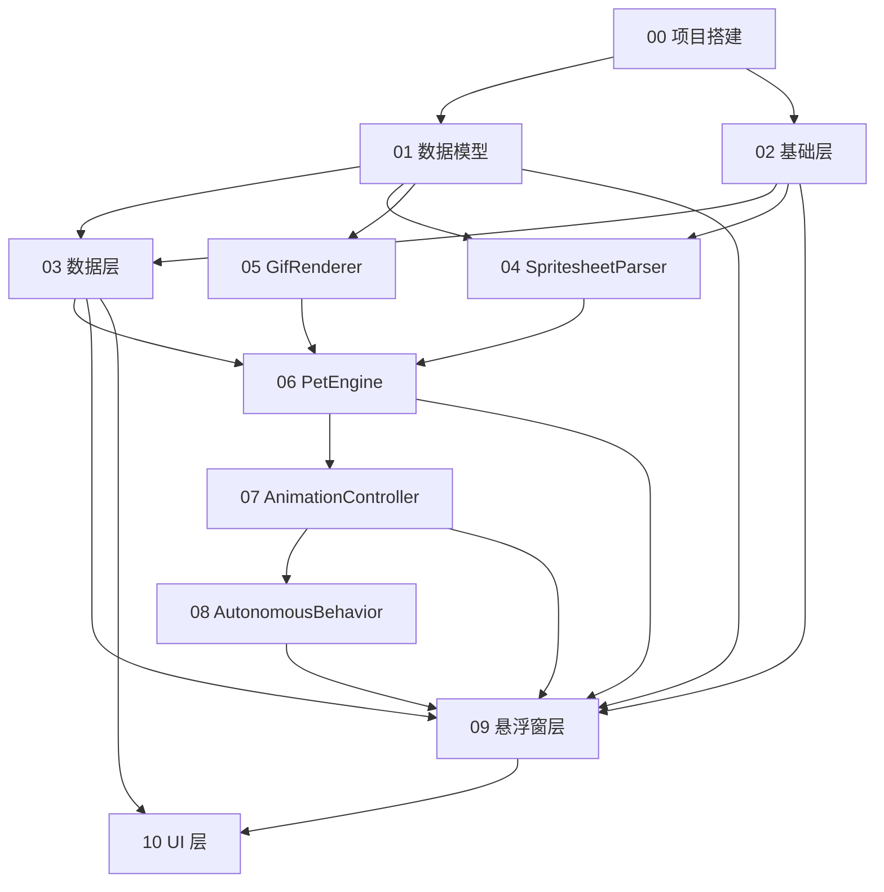

# 桌面宠物 App — 总体进度跟踪

> 最后更新：2026-05-25  
> 总任务数：38 个子任务  
> 完成：0 / 38

---

## 1. 依赖关系图

## 2. 执行顺序

| 阶段 | 任务组 | 可并行 |
|------|--------|:--:|
| **Phase A** | T00 项目搭建 | — |
| **Phase B** | T01 数据模型 ‖ T02 基础层 | ✅ 并行 |
| **Phase C** | T03 数据层 ‖ T04 SpritesheetParser ‖ T05 GifRenderer | ✅ 3 路并行 |
| **Phase D** | T06 PetEngine | — |
| **Phase E** | T07 AnimationController | — |
| **Phase F** | T08 AutonomousBehavior | — |
| **Phase G** | T09 悬浮窗层 | — |
| **Phase H** | T10 UI 层 | — |

## 3. 进度总表

| 任务文件 | 子任务数 | 完成 | 状态 | 阻塞者 |
|----------|:--:|:--:|:--:|--------|
| [00-project-setup.md](00-project-setup.md) | 5 | 0 | ⬜ 待开始 | — |
| [01-data-models.md](01-data-models.md) | 6 | 0 | ⬜ 待开始 | T00 |
| [02-foundation.md](02-foundation.md) | 2 | 0 | ⬜ 待开始 | T00 |
| [03-data-layer.md](03-data-layer.md) | 3 | 0 | ⬜ 待开始 | T01, T02 |
| [04-spritesheet-parser.md](04-spritesheet-parser.md) | 5 | 0 | ⬜ 待开始 | T01, T02 |
| [05-gif-renderer.md](05-gif-renderer.md) | 3 | 0 | ⬜ 待开始 | T01 |
| [06-pet-engine.md](06-pet-engine.md) | 3 | 0 | ⬜ 待开始 | T03, T04, T05 |
| [07-animation-controller.md](07-animation-controller.md) | 5 | 0 | ⬜ 待开始 | T06 |
| [08-autonomous-behavior.md](08-autonomous-behavior.md) | 3 | 0 | ⬜ 待开始 | T07 |
| [09-overlay-layer.md](09-overlay-layer.md) | 4 | 0 | ⬜ 待开始 | T01,T02,T03,T06,T07,T08 |
| [10-ui-layer.md](10-ui-layer.md) | 6 | 0 | ⬜ 待开始 | T03, T09 |
| **合计** | **38** | **0** | | |

## 4. 验收标准映射

| 验收标准 | 对应任务 | 状态 |
|----------|----------|:--:|
| AC-01 悬浮窗显示 | T09-03 | ⬜ |
| AC-02 点击→waving | T09-03 | ⬜ |
| AC-03 拖拽方向动画+移动 | T09-01, T09-03 | ⬜ |
| AC-04 双指缩放 | T09-01 | ⬜ |
| AC-05 导入 Codex Pet | T10-04, T03-03 | ⬜ |
| AC-06 导入 GIF | T10-04, T03-03 | ⬜ |
| AC-07 自主行为 | T08-02 | ⬜ |
| AC-08 Android 8.0 运行 | T10-06 | ⬜ |
| AC-09 无联网权限 | T00-03 | ⬜ |
| AC-10 宠物栏展示 | T10-03 | ⬜ |
