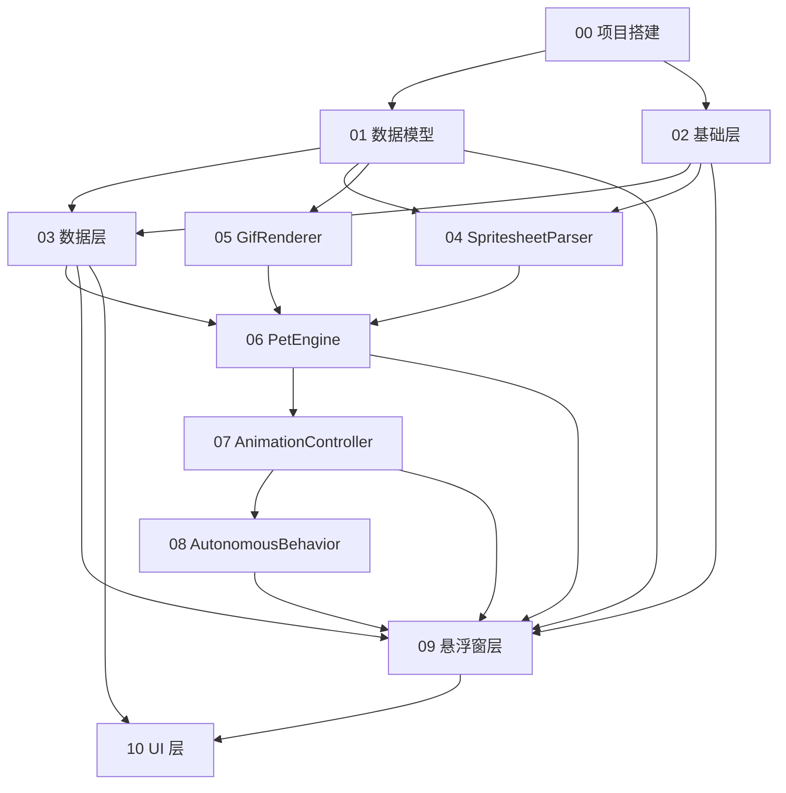

# 桌面宠物 App — 总体进度跟踪

> 最后更新：2026-06-01  
> 总任务数：38 个子任务  
> 完成：36 / 38（2 项延后处理：ViewModel、端到端测试）

---

## 1. 依赖关系图

## 2. 执行顺序

| 阶段 | 任务组 | 可并行 |
|------|--------|:--:|
| **Phase A** | T00 项目搭建 | — |
| **Phase B** | T01 数据模型 ‖ T02 基础层 | ✅ 并行 |
| **Phase C** | T03 数据层 ‖ T04 SpritesheetParser ‖ T05 GifRenderer | ✅ 3 路并行 |
| **Phase D** | T06 PetEngine | — |
| **Phase E** | T07 AnimationController | — |
| **Phase F** | T08 AutonomousBehavior | — |
| **Phase G** | T09 悬浮窗层 | — |
| **Phase H** | T10 UI 层 | — |

## 3. 进度总表

| 任务文件 | 子任务数 | 完成 | 状态 | 说明 |
|----------|:--:|:--:|:--:|------|
| [00-project-setup.md](00-project-setup.md) | 5 | 5 | ✅ 已完成 | Gradle Wrapper 已于 2026-06-01 补全 |
| [01-data-models.md](01-data-models.md) | 6 | 6 | ✅ 已完成 | |
| [02-foundation.md](02-foundation.md) | 2 | 2 | ✅ 已完成 | T02-02 ImageDecoder 功能已合入 SpritesheetParser，不影响使用 |
| [03-data-layer.md](03-data-layer.md) | 3 | 3 | ✅ 已完成 | 额外增加了 IPetStore 接口、SamplePetLoader、备份/恢复功能 |
| [04-spritesheet-parser.md](04-spritesheet-parser.md) | 5 | 5 | ✅ 已完成 | T04-04 非空帧检测经确认不需要（素材无空白帧） |
| [05-gif-renderer.md](05-gif-renderer.md) | 3 | 3 | ✅ 已完成 | 使用 android.graphics.Movie 方案（用户确认不需要 Coil） |
| [06-pet-engine.md](06-pet-engine.md) | 3 | 3 | ✅ 已完成 | |
| [07-animation-controller.md](07-animation-controller.md) | 5 | 5 | ✅ 已完成 | 帧率满足实际视觉效果需求 |
| [08-autonomous-behavior.md](08-autonomous-behavior.md) | 3 | 3 | ✅ 已完成 | |
| [09-overlay-layer.md](09-overlay-layer.md) | 4 | 4 | ✅ 已完成 | |
| [10-ui-layer.md](10-ui-layer.md) | 6 | 4 | ⚠️ 2 项待定 | T10-01 引导页简化（用户要求）；T10-02 ViewModel 延后处理；T10-06 端到端测试未做 |
| **合计** | **38** | **32** | | |

## 4. 验收标准映射

| 验收标准 | 对应任务 | 状态 |
|----------|----------|:--:|
| AC-01 悬浮窗显示 | T09-03 | ✅ |
| AC-02 点击→waving | T09-03 | ✅ |
| AC-03 拖拽方向动画+移动 | T09-01, T09-03 | ✅ |
| AC-04 双指缩放 | T09-01 | ✅ |
| AC-05 导入 Codex Pet | T10-04, T03-03 | ✅ |
| AC-06 导入 GIF | T10-04, T03-03 | ✅ |
| AC-07 自主行为 | T08-02 | ✅ |
| AC-08 Android 8.0 运行 | T10-06 | ⬜ 未测试 |
| AC-09 无联网权限 | T00-03 | ✅ |
| AC-10 宠物栏展示 | T10-03 | ✅ |

## 5. 已知差异（实现 vs 设计）

| 差异点 | 设计 | 实际 | 决定 |
|--------|------|------|------|
| ImageDecoder 独立类 | `foundation/ImageDecoder.kt` | 合入 `SpritesheetParser` | ✅ 接受 |
| GIF 渲染方案 | Coil + AnimatedImageDecoder | `android.graphics.Movie` | ✅ 用户确认不需要 Coil |
| OnboardingGuide | 3 页滑动引导 | 单个 AlertDialog | ✅ 用户要求简化 |
| PetListViewModel | 独立 ViewModel | 逻辑在 MainActivity | ⤵️ 延后处理 |
| 端到端测试 | 完整流程测试 | 未实现 | ⤵️ 延后处理 |
| 非空帧检测 | 自动跳过透明帧 | 未实现 | ✅ 素材无空白帧，不需要 |

## 6. 额外已实现功能（超出原计划）

- 宠物预览缩略图（PetListScreen 中第一帧缩略图缓存）
- 屏幕开关自动暂停/恢复动画
- 宠物导出（单个 + 全部备份为 ZIP）
- 备份恢复（含去重逻辑 + 目录穿越防护）
- 文件选择器方式导入（替代了部分 URI 方案）
- IPetStore 接口抽象（便于单元测试 mock）
- 示例宠物自动加载（assets 7 只宠物首次启动自动导入）
